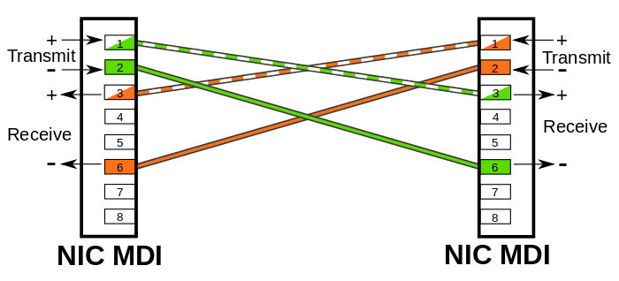
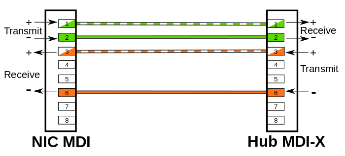

# Understanding MDI vs MDIX and the Convenience of Auto-MDI/MDIX

MDI/MDIX are types of Ethernet interface (both physical and electrical/optical) in a computer network used to carry transmission. They must be connected using the right twisted pair cable so that the transmission pair on one end is linked to the receiving pair on the other end, and vice versa. So what exactly are MDI vs MDIX ports? How do you choose the right Ethernet cabling when connecting MDI to MDIX or MDIX to MDIX? This post will address these issues and offer some insights into auto MDI/MDIX technology.

## 💡 What Are MDI and MDIX?
In Ethernet networking, devices use different port types based on their roles:

📜MDI (Medium Dependent Interface) ports are typically found on endpoint devices like PCs, laptops, servers, or routers. These interfaces send data through pins 1 and 2 and expect to receive it on pins 3 and 6.

MDI also known as an uplink port, is an Ethernet port connection typically used on the NIC (Network Interface Card) or Integrated NIC port on a PC. The transmission signals on a NIC must go to receiving signals on the hub or network switch, so the latter devices have their transmission and receiving signals switched in a configuration known as MDIX – the “X” here represents “crossover”, indicating the reverse of input and output signals.

📜MDIX (Medium Dependent Interface with Crossover) ports are common on network infrastructure equipment such as hubs and switches. They invert the pin assignments—transmitting on pins 3 and 6 and receiving on pins 1 and 2. 

MDIX is an 8P8C port connection often found on a computer, router, hub, or network switch. Since MDIX is the crossover version of the MDI port, the pins 1 & 2 (transmitting) on an MDI device go to pins 1 & 2 (receiving) on an MDIX device via a straight through cable. Similarly, pins 3 & 6 (receiving) on an MDI device go to pins 3 & 6 (transmitting) on an MDIX device. In this case, the MDIX port eliminates the need for a crossover twisted pair cabling.

Thanks to this design, connecting an MDI port directly to an MDIX port requires a straight-through Ethernet cable, preserving proper alignment of transmit and receive pairs. Conversely, linking two identical ports (MDI-to-MDI or MDIX-to-MDIX) requires a crossover cable to swap those signals correctly.

## ❓ Why This Distinction Exists
The rationale traces back to early Ethernet design principles and physical-layer constraints. Networking hardware categorizes devices based on whether they transmit or receive on specific pins—today's terminology aligns with the older DTE (Data Terminal Equipment) and DCE (Data Communication Equipment) model. The layout made the use of straight cables intuitive for most common connections, such as user devices connecting to network gear.

In hindsight, some experts argue having a single wiring standard might’ve simplified cabling—but the existing ecosystem and wiring practices made a uniform transition impractical.

## 🛠️ MDI vs MDIX: How to Choose the Right Cabling?
In general, end stations like PCs or workstations use an MDI interface, whereas hubs and network switches use MDIX interfaces. On other network devices like routers, multiple MDIX ports and a single MDI port often co-exist. The MDI port on the router is designed to connect a cable modem. Both ports are labeled MDI or MDIX to help you choose the right type of cable. As a rule, MDI ports connect to MDIX ports via straight-through twisted pair cabling. As for MDI-to-MDI or MDIX-to-MDIX connections, crossover twisted pair cables are deployed. In some cases, network hubs or switches are built with an MDI port (often switchable) in order to connect to other hubs or switches without a crossover Ethernet cable.

## 📊 What About Ethernet Auto-MDI/MDIX?
As aforementioned, an Ethernet crossover cable is adopted to connect two ports of the same configuration (i.e. MDI-to-MDI or MDIX-to-MDIX). However, it may generate some confusion and inconveniences when deploying two different kinds of Ethernet cables. The auto-MDI/MDIX technology is developed to fix this problem: It automatically switches between MDI and MDIX as required. Auto MDI/MDIX ports on newer device interfaces detect if the connection requires a crossover, then automatically choose the MDI or MDIX configuration to properly match the other end of the link. In this case, it doesn’t matter if you using straight through or crossover cables. The chart below shows cable types for MDI/MDIX and auto-MDIX.

|    Setting    |                 MDI/MDIX Device Type                         |                                                             |
| :-----------: | :----------------------------------------------------------: | :----------------------------------------------------------: |
|  PC or other MDI device  |    Switch, hub, or other MDIX device     |  |
|  MDI  | Crossover cable |                             Straight-through cable                               |
| MDIX  | Straight-through cable | Crossover cable |
| Auto-MDI/MDIX |     Either crossover or straight-through cable     |    |

## 🚀 How Auto-MDI/MDIX Works
Modern network gear with Auto-MDI/MDIX uses signal detection during link initialization to decide whether to swap transmit and receive pairs. On gigabit (and faster) Ethernet networks, this became standard, as all four pairs are bidirectional—making crossover requirements largely irrelevant. 

The negotiation process is fast—within about 500 milliseconds in most cases—even though rare race conditions can extend resolution by up to roughly 1.4 seconds. Furthermore, some systems support "forced-mode auto-MDI/MDIX," which works even without auto-negotiation.

## 🔮 Why This Matters for You
Understanding MDI, MDIX, and Auto-MDI/MDIX is crucial for:

Network setup: Ensuring devices link correctly and reliably.
Troubleshooting: Addressing connectivity issues fast, especially in legacy systems.
Infrastructure planning: Supporting backward compatibility while benefiting from modern features.

## 📌Conclusion
In summary, MDI and MDIX define how Ethernet ports transmit and receive data, traditionally requiring different cable types for proper connections. With the advent of Auto-MDI/MDIX, modern devices can automatically adjust port behavior, eliminating the need for crossover cables and simplifying network deployment. Understanding these concepts ensures smoother troubleshooting, compatibility with older equipment, and more efficient network design.

## Further Reading & Resources

Support for other languages in this project:

- **[Understanding MDI vs MDIX and the Convenience of Auto-MDI/MDIX](https://www.link-pp.com/blog/mdi-vs-mdix-auto-mdimdix-basics.html)**
- **[Interfície dependent del mitjà](https://ca.wikipedia.org/wiki/Interf%C3%ADcie_dependent_del_mitj%C3%A0)**
